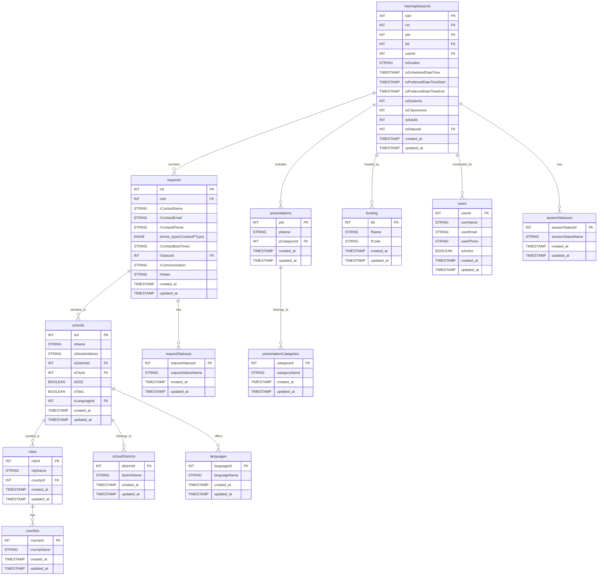

### ERD for the project:

## Order of Insertion

1. **Lookup Tables** (no foreign key dependencies):
    - `languages`
    - `counties`
    - `schoolDistricts`
    - `phoneTypes`
    - `requestStatuses`
    - `sessionStatuses`
    - `presentationCategories`
    - `funding`
    - `users`

2. **Main Tables** (insert in order of foreign key dependencies):
    - `cities` (depends on `counties`)
    - `schools` (depends on `cities`, `schoolDistricts`, `languages`)
    - `requests` (depends on `schools`)
    - `presentations` (depends on `presentationCategories`)
    - `trainingSessions` (depends on `requests`, `presentations`, `funding`, `users`)

---

## Order of Deletion

When deleting records, start from the dependent tables and move up to the parent tables:

1. **Delete from Main Tables** (start with the most dependent):
    - `trainingSessions` (depends on `requests`, `presentations`, `funding`, `users`)
    - `requests` (depends on `schools`)
    - `schools` (depends on `cities`, `schoolDistricts`, `languages`)
    - `cities` (depends on `counties`)

2. **Delete from Lookup Tables** (no dependencies):
    - `languages`
    - `counties`
    - `schoolDistricts`
    - `phoneTypes`
    - `requestStatuses`
    - `sessionStatuses`
    - `presentationCategories`
    - `funding`
    - `users`

 

Todo:
- [ ] Make sure to reset the sequences for the tables that have auto-incrementing primary keys once the actual data is populated.
- [x] Have global styles for the add, edit, view so that the forms look consistent & code is less repetitive.
- [ ] Implement the sorting and filtering for the tables.
- [ ] Implement the search functionality for the tables.
- [ ] Implement the pagination for the tables.
- [ ] Implement multi checkbox selection.
- [ ] Implement the session and cookie management.
- [ ] Have a nice looking Dashboard.
- [ ] Get feedback from the users and make necessary changes.
- [x] Fix the active/inactive boolean checkboxes/dropdowns in user route.
- [ ] Make sure the cities are not duplicate.
- [ ] Make sure the school is checked against the school name, and ~~stret address~~--district-- city for duplicate entry.
- [ ] Add grades information field (string) in the requests as well.
- [ ] Make the grades information field type to be a string in the presentation table.
- [ ] Ask the Ecocycle if there would be a case when more than one users are assigned to a training sessions.
- [ ] For school add/edit form, have the user select the districts first and then populate the schools/counties based on those selected droop down.  
- [ ] Add registrar to every request.
- [ ] THe UI elements should be in the order specified in the Requirements
