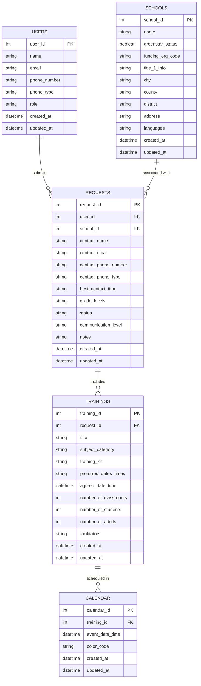

### Potential ERD for the project:

 

## Wireframe for the project (First Draft & MVP - Subject to Change):

### Dashboard Page:
<svg xmlns="http://www.w3.org/2000/svg" viewBox="0 0 800 600">
  

  <!-- Background -->
  <rect width="800" height="600" class="background" />

  <!-- Sidebar -->
  <rect width="200" height="600" class="sidebar" />

  <!-- Navigation Items -->
  <g id="nav-items">
    <text x="20" y="40" class="text nav-item selected">Dashboard</text>
    <text x="20" y="80" class="text nav-item">Requests</text>
    <text x="20" y="120" class="text nav-item">Schools</text>
    <text x="20" y="160" class="text nav-item">Users</text>
    <text x="20" y="200" class="text nav-item">Calendar</text>
    <text x="20" y="240" class="text nav-item">Reports</text>
  </g>

  <!-- Main Content Area -->
  <rect x="200" y="0" width="600" height="600" class="main-content" />

  <!-- Header -->
  <rect x="200" y="0" width="600" height="60" class="header" />
  <text x="220" y="38" class="text title">Eco-Cycle Dashboard</text>

  <!-- Metric Cards -->
  <rect x="220" y="80" width="180" height="100" rx="10" class="card" />
  <text x="310" y="120" class="text subtitle" text-anchor="middle">Total Schools</text>
  <text x="310" y="150" class="text metric" text-anchor="middle">250</text>

  <rect x="420" y="80" width="180" height="100" rx="10" class="card" />
  <text x="510" y="120" class="text subtitle" text-anchor="middle">Active Requests</text>
  <text x="510" y="150" class="text metric" text-anchor="middle">42</text>

  <rect x="620" y="80" width="180" height="100" rx="10" class="card" />
  <text x="710" y="120" class="text subtitle" text-anchor="middle">Upcoming Events</text>
  <text x="710" y="150" class="text metric" text-anchor="middle">15</text>

  <!-- Recent Activity Section -->
  <rect x="220" y="200" width="280" height="380" rx="10" class="card" />
  <text x="240" y="230" class="text subtitle">Recent Activity</text>

  <!-- Calendar Section -->
  <rect x="520" y="200" width="280" height="380" rx="10" class="card" />
  <text x="540" y="230" class="text subtitle">Upcoming Schedule</text>
</svg>

### Request Management Page:

<svg xmlns="http://www.w3.org/2000/svg" viewBox="0 0 1000 600">
  

  <!-- Background -->
  <rect width="1000" height="600" class="background" />

  <!-- Sidebar -->
  <rect width="200" height="600" class="sidebar" />
  <g style="isolation: isolate;">
    <text x="20" y="40" class="text nav-item">Dashboard</text>
    <text x="20" y="80" class="text nav-item selected">Requests</text>
    <text x="20" y="120" class="text nav-item">Schools</text>
    <text x="20" y="160" class="text nav-item">Users</text>
    <text x="20" y="200" class="text nav-item">Calendar</text>
    <text x="20" y="240" class="text nav-item">Reports</text>
  </g>

  <!-- Main Content Area -->
  <rect x="200" y="0" width="800" height="600" class="main-content" />

  <!-- Header with Title and Add Button -->
  <rect x="200" y="0" width="800" height="60" class="header" />
  <text x="220" y="38" class="text title">Request Management</text>

  <!-- Add New Request Button -->
  <rect x="800" y="15" width="150" height="30" rx="5" class="button" />
  <text x="830" y="35" class="text add-button-text">+ New Request</text>

  <!-- Search Bar -->
  <rect x="220" y="80" width="450" height="30" rx="5" class="search-box" />
  <text x="230" y="100" class="text search-text">Search requests...</text>

  <!-- Filter Section -->
  <rect x="690" y="80" width="120" height="30" rx="5" class="filter" />
  <text x="700" y="100" class="text filter-button">Filter by Status</text>
  <rect x="820" y="80" width="120" height="30" rx="5" class="filter" />
  <text x="830" y="100" class="text filter-button">Filter by Date</text>

  <!-- Request List Header -->
  <rect x="220" y="130" width="720" height="40" class="request-list" />
  <text x="230" y="155" class="text search-text">Request ID</text>
  <text x="400" y="155" class="text search-text">Requester</text>
  <text x="600" y="155" class="text search-text">Status</text>
  <text x="800" y="155" class="text search-text">Date</text>

  <!-- Request List Items (example of 3 items) -->
  <rect x="220" y="180" width="720" height="40" class="request-list" />
  <text x="230" y="205" class="text search-text">REQ-001</text>
  <text x="400" y="205" class="text search-text">John Doe</text>
  <text x="600" y="205" class="text search-text">Pending</text>
  <text x="800" y="205" class="text search-text">2024-09-01</text>

  <rect x="220" y="230" width="720" height="40" class="request-list" />
  <text x="230" y="255" class="text search-text">REQ-002</text>
  <text x="400" y="255" class="text search-text">Jane Smith</text>
  <text x="600" y="255" class="text search-text">Completed</text>
  <text x="800" y="255" class="text search-text">2024-09-05</text>

  <rect x="220" y="280" width="720" height="40" class="request-list" />
  <text x="230" y="305" class="text search-text">REQ-003</text>
  <text x="400" y="305" class="text search-text">Michael Lee</text>
  <text x="600" y="305" class="text search-text">In Progress</text>
  <text x="800" y="305" class="text search-text">2024-09-06</text>
</svg>
