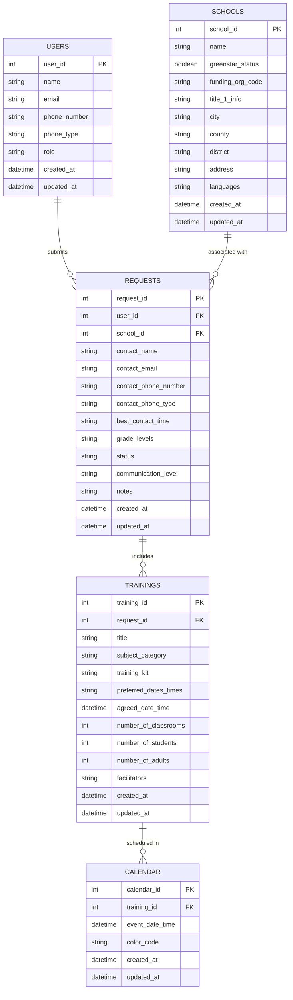
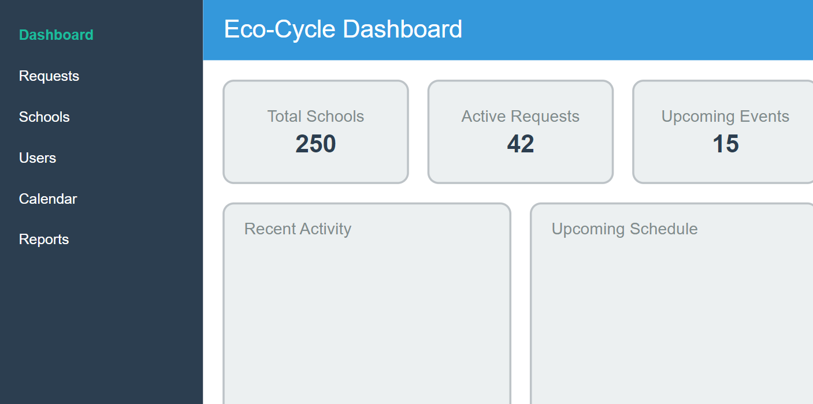
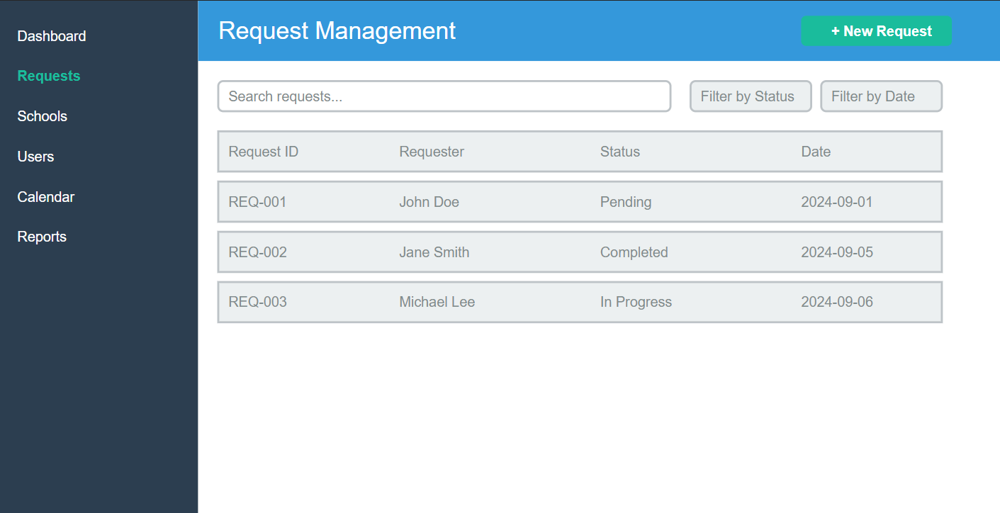

### Potential ERD for the project:

```mermaid
erDiagram
    USERS {
        int user_id PK
        string name
        string email
        string phone_number
        string phone_type
        string role
        datetime created_at
        datetime updated_at
    }
    
    SCHOOLS {
        int school_id PK
        string name
        boolean greenstar_status
        string funding_org_code
        string title_1_info
        string city
        string county
        string district
        string address
        string languages
        datetime created_at
        datetime updated_at
    }
    
    REQUESTS {
        int request_id PK
        int user_id FK
        int school_id FK
        string contact_name
        string contact_email
        string contact_phone_number
        string contact_phone_type
        string best_contact_time
        string grade_levels
        string status
        string communication_level
        string notes
        datetime created_at
        datetime updated_at
    }
    
    TRAININGS {
        int training_id PK
        int request_id FK
        string title
        string subject_category
        string training_kit
        string preferred_dates_times
        datetime agreed_date_time
        int number_of_classrooms
        int number_of_students
        int number_of_adults
        string facilitators
        datetime created_at
        datetime updated_at
    }

    CALENDAR {
        int calendar_id PK
        int training_id FK
        datetime event_date_time
        string color_code
        datetime created_at
        datetime updated_at
    }

    USERS ||--o{ REQUESTS: "submits"
    SCHOOLS ||--o{ REQUESTS: "associated with"
    REQUESTS ||--o{ TRAININGS: "includes"
    TRAININGS ||--o{ CALENDAR: "scheduled in"

```

 

## Wireframe for the project (First Draft & MVP - Subject to Change):

### Dashboard Page:

### Request Management Page:

