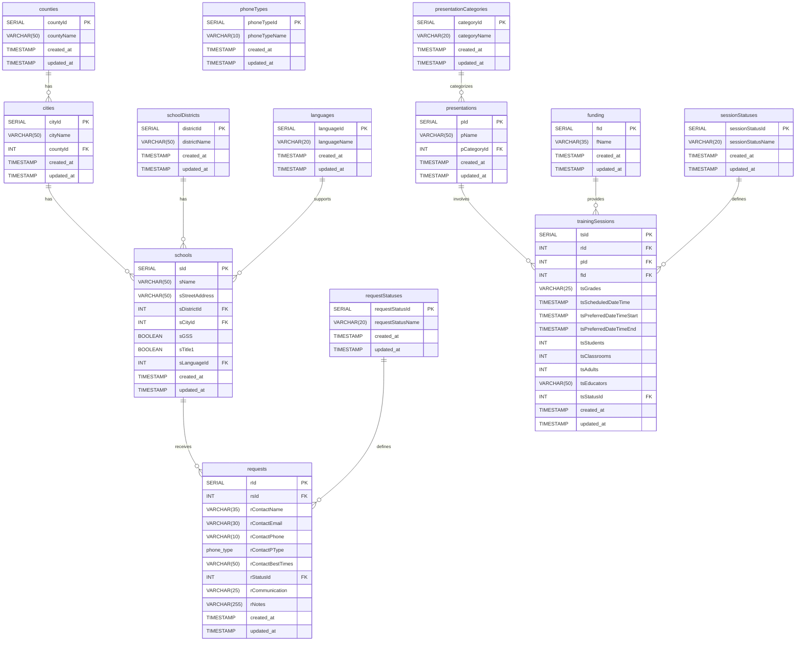

### ERD for the project:

 

## Wireframe for the project (First Draft & MVP - Subject to Change):

### Dashboard Section:

### Request Management Section:

### School Management Section:

### User Management Section:

### Calendar Section:

