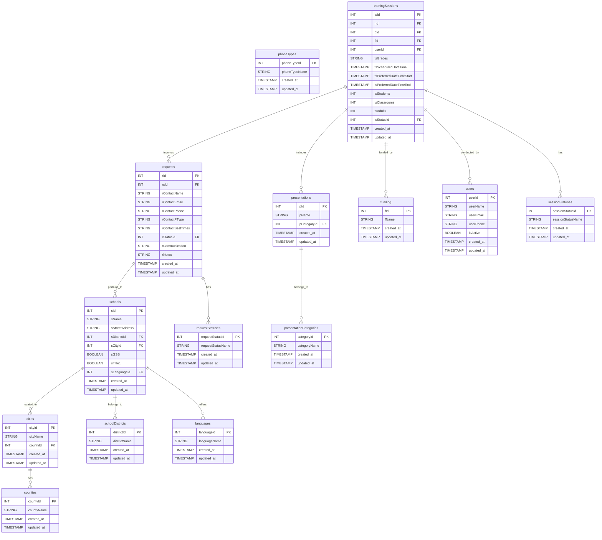
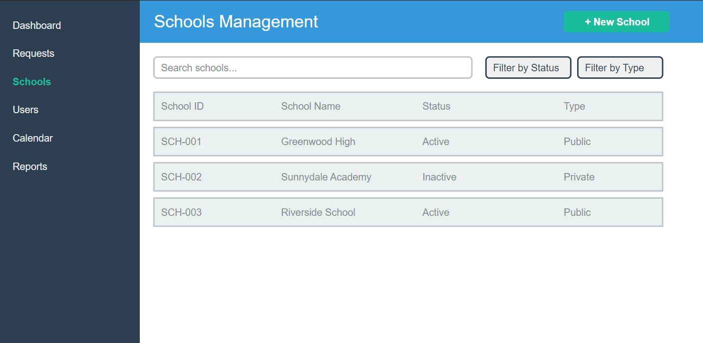
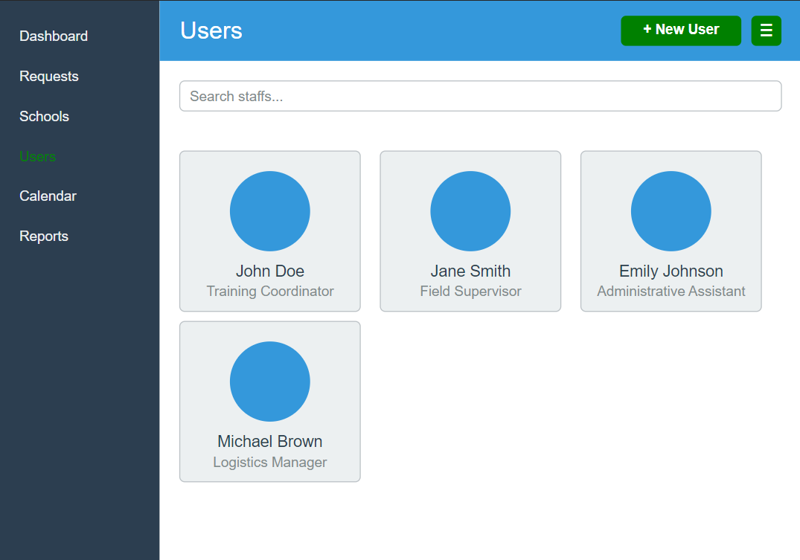
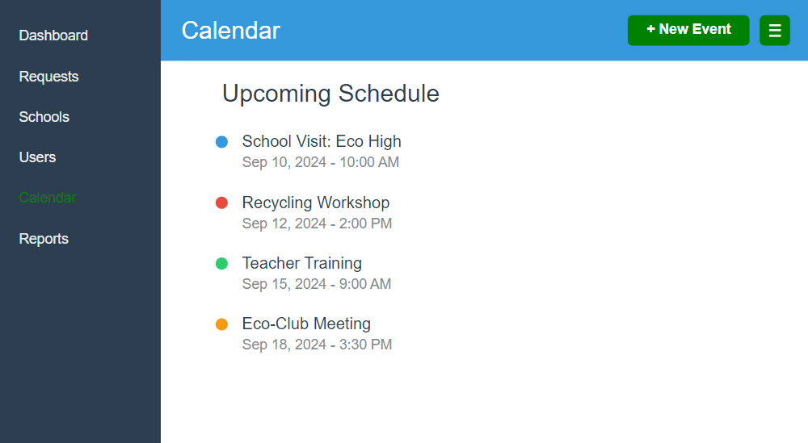

### ERD for the project:

## Order of Insertion

1. **Lookup Tables** (no foreign key dependencies):
    - `languages`
    - `counties`
    - `schoolDistricts`
    - `phoneTypes`
    - `requestStatuses`
    - `sessionStatuses`
    - `presentationCategories`
    - `funding`
    - `users`

2. **Main Tables** (insert in order of foreign key dependencies):
    - `cities` (depends on `counties`)
    - `schools` (depends on `cities`, `schoolDistricts`, `languages`)
    - `requests` (depends on `schools`)
    - `presentations` (depends on `presentationCategories`)
    - `trainingSessions` (depends on `requests`, `presentations`, `funding`, `users`)

---

## Order of Deletion

When deleting records, start from the dependent tables and move up to the parent tables:

1. **Delete from Main Tables** (start with the most dependent):
    - `trainingSessions` (depends on `requests`, `presentations`, `funding`, `users`)
    - `requests` (depends on `schools`)
    - `schools` (depends on `cities`, `schoolDistricts`, `languages`)
    - `cities` (depends on `counties`)

2. **Delete from Lookup Tables** (no dependencies):
    - `languages`
    - `counties`
    - `schoolDistricts`
    - `phoneTypes`
    - `requestStatuses`
    - `sessionStatuses`
    - `presentationCategories`
    - `funding`
    - `users`

 

## Wireframe for the project (First Draft & MVP - Subject to Change):

### Dashboard Section:

### Request Management Section:

### School Management Section:

### User Management Section:

### Calendar Section:

